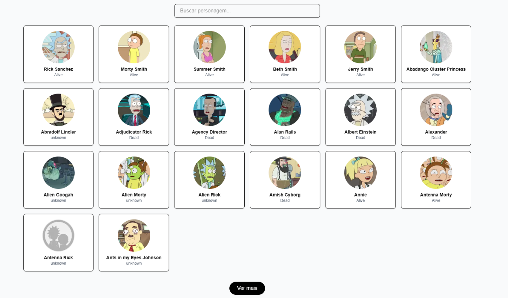
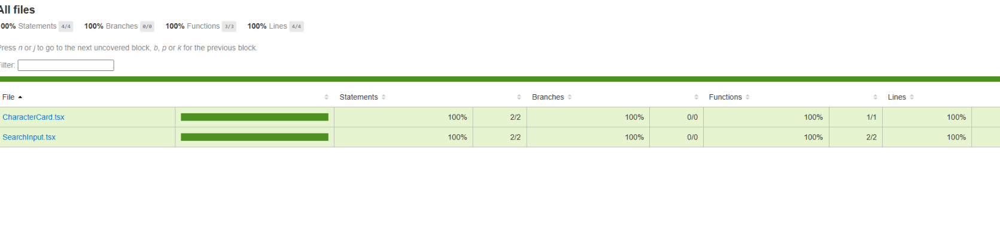

# Rick and Morty  🔍🛸

Projeto desenvolvido em **Next.js** + **TypeScript** + **TailwindCSS** + **React Query**, que consome a API pública [Rick and Morty API](https://rickandmortyapi.com/) para listar e filtrar personagens em tempo real.

---

## 🚀 Tecnologias

- [Next.js](https://nextjs.org/)
- [TypeScript](https://www.typescriptlang.org/)
- [TailwindCSS](https://tailwindcss.com/)
- [React Query](https://tanstack.com/query)
- [Jest](https://jestjs.io/) + [Testing Library](https://testing-library.com/)

---

## 📸 Projeto Rodando

> Abaixo uma prévia do projeto em execução listando personagens:

---

## 🔍 Funcionalidades

- Listagem paginada de personagens
- Busca de personagens por nome
- Filtro de resultados em tempo real
- Carregamento automático com paginação infinita
- Testes unitários com cobertura de código

---

## 🧪 Testes Automatizados

O projeto possui testes unitários com cobertura de 100% para os componentes `SearchInput` e `CharacterCard`.

> Resultado dos testes:

---

## 🛠️ Instalação e Uso

# Clone o repositório
> git clone https://github.com/HLDESENVOLVIMENTOWEB/orys-app
>
> cd orys-app

# Instale as dependências
> npm install

# Rode o projeto em ambiente de desenvolvimento
> npm run dev

# Para rodar os testes
>  run test

# Para rodar os testes com cobertura
> npm run test:coverage

